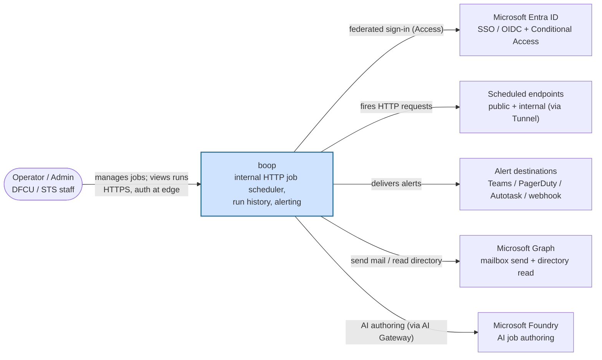
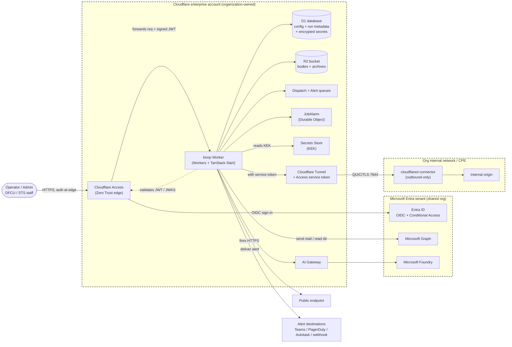

# boop Security Architecture

Security architecture and control mapping for `boop`, an internally developed job scheduler, prepared for internal NCUA Information Security Examination (ISE) and GLBA (12 CFR Part 748, Appendices A and B) review.

**Last reviewed:** 2026-07-20

This is a living document. It describes the current implementation and is updated as the application changes. Control claims cite the file, configuration, or Architecture Decision Record (ADR) that substantiates them. Gaps and partial controls are stated plainly.

## 1. Executive summary

boop is an internally built, internal-use web application that fires scheduled or webhook-triggered HTTP requests against endpoints the organization operates, records the outcomes, and alerts staff when something fails. Its only users are Desert Financial Credit Union and SwitchThink Solutions (STS) staff, who sign in with their existing organizational Microsoft accounts. Its data lives in the organization's own Cloudflare account (a serverless database and object store) and consists of job schedules, run results, endpoint and alert configuration, and encrypted operational secrets. boop does not access, store, or transmit member nonpublic personal information (NPI); see Section 3. It runs on Cloudflare's serverless platform and authenticates staff at the network edge through Cloudflare Access fronting the organization's Microsoft Entra identity provider, so no request reaches the application before the user is authenticated.

## 2. Scope and data classification

### 2.1 What boop is

boop is a **first-party, internally developed, internal-use application**, not a third-party or vendor product. It was built by an STS/DFCU employee, runs on the organization's own Cloudflare enterprise account, and authenticates the organization's own staff through the organization's Microsoft Entra tenant. Access is limited to internal users. Because it is first-party and internal, it is assessed as an in-house information system under the credit union's information security program, not through a third-party / vendor risk (TPRM) lens. boop does not require its own SOC 2 report; the platform subprocessors it runs on (Cloudflare and Microsoft) carry SOC 2 and are the organization's already-vetted vendors (Section 8).

### 2.2 Organizational context

Desert Financial Credit Union and its wholly-owned CUSO, SwitchThink Solutions, operate as one consolidated organization sharing a single Microsoft Entra tenant and a single Cloudflare enterprise account. boop is deployed within that shared account and tenant.

### 2.3 Data classification (organizational determination)

**The organization has determined that boop does not access, store, or transmit member nonpublic personal information (NPI).** This is an organizational attestation recorded here as the applicable data classification for this review.

boop handles **operational data only**:

- Job definitions and schedules (cron / interval / webhook triggers), and request body/header templates ([`src/lib/db/schema.ts`](../../src/lib/db/schema.ts), `jobs`).
- Target, Channel, and Tunnel configuration (endpoint URLs, alert-destination settings, tunnel and connector metadata) (`targets`, `channels`, `tunnels`).
- Run and Attempt outcomes and metadata (status, outcome, failure kind, timing) (`runs`, `attempts`).
- Request and response bodies from the scheduled endpoints, stored in object storage for troubleshooting (`attempts.requestBodyR2Key` / `responseBodyR2Key`).
- Encrypted, per-Workspace operational secrets (for example API keys used by the endpoints boop calls) (`workspace_secrets`).
- Staff-facing alert content and the staff directory used to address alert email.

Tunnel connectors (`cloudflared`) may run on systems located within customer-premises equipment (CPE), but they are used only to reach operational and internal endpoints and carry no member data. The request/response bodies boop retains are the payloads of the operational endpoints it schedules against; the organization's determination is that these operational endpoints do not return member NPI to boop.

### 2.4 Assurance and independence (summary)

Because boop was built in-house by a single developer, the security **assessment and testing** of the application (as distinct from this descriptive document) should be performed or reviewed by staff independent of the developer, consistent with Part 748, Appendix A. This is expanded in Section 9.

## 3. System context (C4 level 1)

The diagram below shows boop and the external actors and systems it interacts with. It is the C4 "System Context" view: one box for boop, everyone and everything it talks to around it.

Caption: boop is used only by organizational staff, who authenticate through the organization's Entra identity provider; its outbound interactions are to the endpoints it schedules, the alert destinations it notifies, and Microsoft services for email and AI authoring.

## 4. Containers and trust boundaries (C4 level 2)

The diagram below decomposes boop into its runtime pieces and overlays trust boundaries (OWASP data-flow style). Requests cross from the operator's device, through the Cloudflare edge (where authentication happens), into the Worker and its data stores, and outward to the endpoints, Microsoft services, and, for private targets, into the organization's internal network.

Caption: authentication happens at the Cloudflare Access edge before any request reaches the Worker; the Worker holds no long-lived member data, stores only operational config and run metadata (with workspace secrets envelope-encrypted), and reaches internal origins only through an authenticated Cloudflare Tunnel.

## 5. Data-flow walkthroughs

### 5.1 A scheduled job fires and dispatches an outbound request

1. A single Worker cron trigger (the "heartbeat") runs every minute and selects jobs that are due ([`src/lib/dispatch/scheduled.ts`](../../src/lib/dispatch/scheduled.ts); trigger declared in [`wrangler.jsonc`](../../wrangler.jsonc) `triggers.crons`). This path runs inside the Cloudflare trust boundary and is not exposed to any external caller.
2. Due jobs are enqueued to the Dispatch queue; the queue consumer invokes the shared dispatcher `dispatchRun()` ([`src/lib/dispatch/dispatch-run.ts`](../../src/lib/dispatch/dispatch-run.ts)). Interval-based jobs instead fire via a per-job Durable Object alarm; both lanes converge on the same dispatcher.
3. The dispatcher renders the job's body and header templates. Template values may include workspace secrets, which are decrypted on demand: the Key-Encryption-Key (KEK) is read from Cloudflare Secrets Store and used to decrypt the AES-GCM ciphertext stored in D1 (`fetchActiveSecretPlaintext`, [`src/lib/workspace-secrets/commands.ts`](../../src/lib/workspace-secrets/commands.ts); crypto in [`src/lib/workspace-secrets/envelope.ts`](../../src/lib/workspace-secrets/envelope.ts)).
4. If the target is private (`reachability = 'tunnel'`), the dispatcher resolves the tunnel's Cloudflare Access service-token credentials and injects `CF-Access-Client-Id` / `CF-Access-Client-Secret` headers ([`src/lib/tunnels/access-headers.ts`](../../src/lib/tunnels/access-headers.ts)). A tunnel target with no assigned tunnel or missing credentials fails closed (the request is never sent unauthenticated) and the run is recorded as `tunnel_credential_missing`.
5. The Worker issues the HTTP request over TLS. **Trust-boundary crossing:** for a public target the request leaves Cloudflare to the public internet; for a private target it travels over the Cloudflare Tunnel (QUIC/TLS) to the `cloudflared` connector inside the organization's internal network, which forwards it to the on-prem origin. The connector makes only outbound connections; no inbound port is opened in the internal network (ADR-028).
6. The request and response bodies are streamed to R2 and the Run/Attempt outcome is written to D1. Sensitive request headers (`authorization`, `cookie`, `x-api-key`, `cf-access-client-id`, `cf-access-client-secret`, and others) are redacted before the header set is persisted ([`src/lib/runs/header-redaction.ts`](../../src/lib/runs/header-redaction.ts)).
7. Alert rules are evaluated against the terminal run; if any match, an alert message is enqueued to the Alert queue (Section 5.2).

Where authN/authZ apply: this flow is machine-initiated inside the trust boundary and has no interactive user. Outbound authentication to the target is the target's own configured credential (bearer/basic/header) or, for private targets, the Cloudflare Access service token.

### 5.2 An alert is delivered via a channel

1. A terminal run that matches an alert rule places a message on the Alert queue; the alert queue consumer picks it up ([`src/lib/alert-queue/consumer.ts`](../../src/lib/alert-queue/consumer.ts)). This runs inside the Cloudflare trust boundary.
2. The consumer loads the run/job/workspace context, resolves the fan-out set of channels for the matching rules, and dispatches to each channel's adapter ([`src/lib/channel-adapters/registry.ts`](../../src/lib/channel-adapters/registry.ts)).
3. For a webhook, Teams, PagerDuty, or Autotask channel, the adapter makes an outbound HTTPS request to the configured destination. **Trust-boundary crossing:** the alert leaves Cloudflare to the third-party destination over TLS.
4. For an email channel, the adapter renders the subject/body templates and calls the Microsoft Graph transport ([`src/lib/channel-adapters/email.ts`](../../src/lib/channel-adapters/email.ts) -> [`src/lib/email-recipe/graph.ts`](../../src/lib/email-recipe/graph.ts)). **Trust-boundary crossing + authN:** the Worker first obtains an OAuth token from Microsoft Entra using the client-credentials grant (`GRAPH_CLIENT_SECRET`, a Worker secret), then calls Graph `sendMail` on the shared mailbox over TLS. Mail is sent from a dedicated shared mailbox scoped to the boop application (project configuration; production only).
5. The channel's last-used and delivery-status metadata are recorded in D1.

Where authN/authZ apply: alert delivery is machine-initiated. Outbound authentication is per-channel (webhook signatures/keys held in channel config, or the Graph OAuth client credential for email). No member data is included; alert content is operational (job name, outcome, timing).

## 6. Security controls (mapped to 12 CFR Part 748, Appendix A)

Appendix A requires a credit union's information security program to include specific safeguards. The table maps boop's implemented controls to those themes, with a citation for each, and states gaps honestly.

| Appendix A theme | Control in boop | Evidence / citation | Status |
|---|---|---|---|
| Access controls / authentication (III.C.1.a) | Every request is authenticated at the Cloudflare Access edge before it reaches the Worker. The Worker independently validates the `Cf-Access-Jwt-Assertion` JWT against the Access team JWKS using `jose`, checking issuer and audience. No password storage; MFA and Conditional Access are enforced by Entra. | [`src/lib/auth/verify-access-jwt.ts`](../../src/lib/auth/verify-access-jwt.ts), [`src/lib/auth/get-current-user.ts`](../../src/lib/auth/get-current-user.ts), [`src/lib/auth/auth-middleware.ts`](../../src/lib/auth/auth-middleware.ts); [ADR-026](../adr/026-cloudflare-access-with-entra-oidc.md), [ADR-005](../adr/005-auth-provider-abstraction.md) | Implemented |
| Authorization / least privilege | Two roles: `admin` and `operator`. Server functions that manage global config require admin via middleware; identity reads flow only through the `getCurrentUser` abstraction. Role is assigned at first provisioning (first user becomes admin, all others operator). | [`src/lib/auth/is-admin.ts`](../../src/lib/auth/is-admin.ts), [`src/lib/auth/admin-middleware.ts`](../../src/lib/auth/admin-middleware.ts), [`src/lib/auth/provision-user.ts`](../../src/lib/auth/provision-user.ts); [ADR-016](../adr/016-operator-authz.md) | Implemented; **partial**: group-claim-driven role mapping is a planned follow-up, not yet implemented (ADR-026). |
| Local development safety | The dev auth bypass is hard-gated to `PUBLIC_ENV=dev`; production sets `PUBLIC_ENV=production`, so the bypass cannot activate in production. | [`src/lib/auth/dev-bypass.ts`](../../src/lib/auth/dev-bypass.ts); [`wrangler.jsonc`](../../wrangler.jsonc) `env.production.vars.PUBLIC_ENV` | Implemented |
| Inbound webhook authentication | Webhook-triggered jobs verify an HMAC signature (`X-Boop-Signature`) against active per-job secrets, and are rate-limited per workspace before dispatch. | [`src/lib/dispatch/webhook.ts`](../../src/lib/dispatch/webhook.ts), [`src/lib/webhook-signing/verify.ts`](../../src/lib/webhook-signing/verify.ts); rate limit in [`wrangler.jsonc`](../../wrangler.jsonc) | Implemented |
| Encryption in transit (III.C.1.c) | TLS on every hop: browser to Cloudflare edge, Worker to Microsoft Graph/Entra/Foundry, Worker to scheduled endpoints, and Worker to internal origins over the Cloudflare Tunnel (QUIC/TLS on UDP 7844). | [`src/lib/email-recipe/graph.ts`](../../src/lib/email-recipe/graph.ts), [`src/lib/tunnels/access-headers.ts`](../../src/lib/tunnels/access-headers.ts); [ADR-028](../adr/028-private-tunnels.md) | Implemented (application enforces HTTPS endpoints; TLS termination is a Cloudflare platform control). |
| Encryption at rest (III.C.1.c) - platform | D1 (database) and R2 (bodies/archives) are encrypted at rest by the Cloudflare platform. D1: "All objects stored in D1, including metadata, live databases, and inactive databases are encrypted at rest." R2: objects are "encrypted using AES-256" in GCM mode with keys managed by Cloudflare. Encryption is automatic and not user-configurable. | [Cloudflare D1 data security](https://developers.cloudflare.com/d1/reference/data-security/), [Cloudflare R2 data security](https://developers.cloudflare.com/r2/reference/data-security/) | Implemented (platform control) |
| Encryption at rest - application (workspace secrets) | Workspace secrets are envelope-encrypted before storage: AES-256-GCM with a fresh 96-bit random IV per secret, using a 32-byte KEK held in Cloudflare Secrets Store (never in the database or source). Only ciphertext and IV are stored in D1, plus a SHA-256 hash for duplicate detection. Secrets are decrypted only in-memory at fire time. | [`src/lib/workspace-secrets/envelope.ts`](../../src/lib/workspace-secrets/envelope.ts), [`src/lib/workspace-secrets/commands.ts`](../../src/lib/workspace-secrets/commands.ts); `workspace_secrets` in [`src/lib/db/schema.ts`](../../src/lib/db/schema.ts) | Implemented |
| Secrets management | Application secrets are Worker secrets set via `wrangler secret put` (values not stored in the repo): `FOUNDRY_API_KEY`, `GRAPH_CLIENT_SECRET`, `GRAPH_DIR_CLIENT_SECRET`, `CF_PROVIDER_API_TOKEN`. The KEK is a Secrets Store binding (`BOOP_SECRETS_KEK`). Cloudflare stores Worker/Secrets Store secrets encrypted and does not display values after creation. Sensitive headers are redacted before run metadata is persisted. | [`wrangler.jsonc`](../../wrangler.jsonc) (`secrets_store_secrets`), [`src/lib/ai/client.ts`](../../src/lib/ai/client.ts), [`src/lib/email-recipe/graph.ts`](../../src/lib/email-recipe/graph.ts), [`src/lib/tunnels/provider.ts`](../../src/lib/tunnels/provider.ts), [`src/lib/runs/header-redaction.ts`](../../src/lib/runs/header-redaction.ts); [Cloudflare Workers Secrets docs](https://developers.cloudflare.com/workers/configuration/secrets/) | Implemented. Per-job inbound webhook signing secrets (`webhook_secrets`) are envelope-encrypted at rest with the KEK (AES-256-GCM), decrypted only on the verify path, which fails closed on any secret it cannot decrypt ([`src/lib/webhook-secrets/commands.ts`](../../src/lib/webhook-secrets/commands.ts), [`src/lib/webhook-secrets/queries.ts`](../../src/lib/webhook-secrets/queries.ts)). Legacy plaintext rows stay valid until rotated, then are stored encrypted. |
| Private-origin reachability (least privilege to internal network) | Internal origins are reached only through a provider-owned Cloudflare Tunnel with an Access service-token policy; the connector is outbound-only (no inbound port). The dispatcher fails closed if credentials are missing, and the verify path pins the service token to an active, tunnel-reachable target on that specific tunnel to prevent a mid-create race from sending the token to an attacker-controlled URL. | [`src/lib/tunnels/access-headers.ts`](../../src/lib/tunnels/access-headers.ts), [`src/lib/tunnels/verify.ts`](../../src/lib/tunnels/verify.ts); [ADR-028](../adr/028-private-tunnels.md) | Implemented |
| Logging and monitoring (III.C.1.g) | Structured JSON events (`logInfo`/`logWarn`/`logError`) flow to Cloudflare Workers Logs, which auto-indexes fields; observability is enabled with full head sampling. Auth failures, dispatch failures, webhook rejections/rate-limits, and tunnel credential failures are logged. | [`src/lib/log.ts`](../../src/lib/log.ts); [`wrangler.jsonc`](../../wrangler.jsonc) `observability` | Implemented. **Partial**: no application-level alerting on security events (e.g. repeated auth failures) is configured in-repo; Sentry/OTel overlay is recipe-optional and not wired. |
| Change management / secure SDLC (III.C.1.e) | All changes go through GitHub with CI gates on every PR and push: lint/format, type-check + build, tests, OpenAPI contract check, and a structural pattern audit. Deployment is gated: push to `main` deploys to dev; a `v*` tag deploys to production, which re-runs the full gate set on the tagged commit. D1 migrations are applied by the pipeline. | [`.github/workflows/main.yml`](../../.github/workflows/main.yml), [`.github/workflows/deploy-production.yml`](../../.github/workflows/deploy-production.yml); [ADR-009](../adr/009-opinionated-stack-and-pattern-enforcement.md) | Implemented |
| Response program / incident response (Appendix B) | boop-specific incident-response steps (detection, containment, evidence, escalation) are documented in Section 10 and defer to the DFCU enterprise Incident Response Plan for the member-notification decision path and regulatory escalation. | Section 10 (Incident response) | Implemented (procedure documented; escalation defers to the enterprise IR plan). |
| Protection against destruction / loss (III.C.1.h) | D1 is a managed database with platform durability; older run/attempt records are archived to R2 rather than deleted (hot-window archival). Deletes in the domain are soft-delete by policy. | [ADR-019](../adr/019-soft-delete-policy.md); `CONTEXT.md` "Hot window", "Storage and tenancy" | Implemented (platform durability); **verify**: no boop-specific backup/restore runbook documented. |
| Physical / hosting security | boop runs entirely on Cloudflare's serverless platform and Microsoft's cloud; there is no self-managed server or data center in scope. Physical and environmental controls are inherited from the subprocessors (Section 8). | [ADR-001](../adr/001-cloudflare-workers-runtime.md); Section 8 | Inherited platform control |

## 7. Notes on the auth flow (authN then authZ)

- **Authentication (edge, before the Worker):** Cloudflare Access sits in front of the Worker's hostname. A user is redirected to the organization's Entra sign-in (with the tenant's MFA / Conditional Access), and Access issues a signed `Cf-Access-Jwt-Assertion` header on the forwarded request. The Worker re-validates that JWT against the Access team JWKS (`TEAM_DOMAIN/cdn-cgi/access/certs`), checking signature, issuer, and audience (`POLICY_AUD`), and rejects on any failure. Each environment has its own Access application and audience tag ([`src/lib/auth/verify-access-jwt.ts`](../../src/lib/auth/verify-access-jwt.ts); [`wrangler.jsonc`](../../wrangler.jsonc)).
- **Authorization (in the Worker):** the validated identity is provisioned into the `users` table and carries a role. Admin-only server functions are guarded by `adminMiddleware`, which composes the auth middleware and then requires the `admin` role ([`src/lib/auth/admin-middleware.ts`](../../src/lib/auth/admin-middleware.ts)). All other authenticated staff act as `operator`.

## 8. External dependencies (subprocessors)

These are the organization's already-vetted platform vendors. None receive member NPI from boop.

| Subprocessor | Services used | Purpose in boop | Member-data exposure |
|---|---|---|---|
| Cloudflare | Workers, D1, R2, Queues, Durable Objects, Access, Tunnel, Secrets Store, AI Gateway | Runtime, database, object storage, job dispatch, edge authentication, private-origin reachability, KEK storage, AI proxy | None (operational data only) |
| Microsoft | Entra ID (OIDC + Conditional Access), Graph (shared-mailbox send + directory read), Foundry (AI) | Staff authentication, alert email + recipient directory, natural-language job authoring | None (staff identity and operational alert content only) |

Both are enterprise vendors the organization already uses and assesses under its vendor-management program; boop consumes them within the organization's own accounts. Boop itself is first-party and internal and is not a vendor to the credit union.

## 9. Assurance and independence

- **What CI already enforces.** Every change is gated by automated checks (build, type-check, tests, OpenAPI contract, structural pattern audit) and by branch-based deployment with a re-verification gate on the production tag ([`.github/workflows/main.yml`](../../.github/workflows/main.yml), [`.github/workflows/deploy-production.yml`](../../.github/workflows/deploy-production.yml)). Code changes are reviewed via pull request.
- **Independence of testing (Part 748, Appendix A).** boop was developed by a single in-house developer. To satisfy the expectation that security testing is performed by staff independent of the person who built the system, the security **assessment and testing** (vulnerability assessment, penetration testing, and control validation) should be performed or reviewed by staff or a party independent of the developer. That independent assessment is distinct from this descriptive document.
- **What an independent review would add.** A dynamic/authenticated test of the Access-plus-JWT auth path, validation of the tunnel service-token race guard, and creation of a backup/restore runbook.

## 10. Incident response

boop is an in-house application of the consolidated organization; incident response is governed by the **Desert Financial Credit Union enterprise Incident Response Plan** (12 CFR Part 748, Appendix B), which owns the member-notification decision path and regulatory escalation. This section records the boop-specific first steps that feed that plan.

- **Detection.** Security-relevant events (authentication failures, webhook rejections and rate-limits, tunnel credential failures, dispatch failures) are logged as structured events to Cloudflare Workers Logs (Section 6, Logging and monitoring).
- **Containment.** Pause or disable the affected Job to halt scheduled and inbound dispatch; revoke the Job's webhook signing secrets and, for a private target, the tunnel's Access service token; if the Worker itself is implicated, roll back to the previous tagged release or disable the application at Cloudflare Access.
- **Evidence.** Run and Attempt records (D1) plus Workers Logs establish the timeline; request and response bodies are retained in R2. Sensitive headers are redacted at capture (Section 6).
- **Escalation and member notification.** Follow the enterprise IR Plan. Because boop holds no member NPI (Section 2.3), a boop incident is not expected to trigger the Appendix B member-notification path, but that determination is made under the enterprise plan, not presumed here.
- **Enterprise plan reference:** _[link to the DFCU enterprise Incident Response Plan]_.

## 11. Glossary

- **CUSO** - Credit Union Service Organization. SwitchThink Solutions is a wholly-owned CUSO of Desert Financial Credit Union.
- **NPI** - Nonpublic Personal Information; member financial information protected under GLBA / 12 CFR Part 748, Appendix A. boop does not handle NPI (Section 3).
- **Entra OIDC** - Microsoft Entra ID acting as the organization's OpenID Connect identity provider (single sign-on).
- **CF Access (Cloudflare Access)** - Cloudflare's Zero Trust edge authentication that sits in front of the application and only forwards requests from authenticated users, adding a signed identity header.
- **Cloudflare Tunnel** - an outbound-only connection (via the `cloudflared` connector) that lets Cloudflare reach an internal service without opening any inbound port in the internal network.
- **KEK** - Key-Encryption-Key; the master key (held in Cloudflare Secrets Store) used to encrypt and decrypt the stored workspace secrets (envelope encryption).
- **D1** - Cloudflare's managed serverless SQL database (SQLite-based) where boop stores operational configuration and run metadata.
- **CPE** - Customer-Premises Equipment; systems located on the customer/internal side of the network where a tunnel connector may run.
