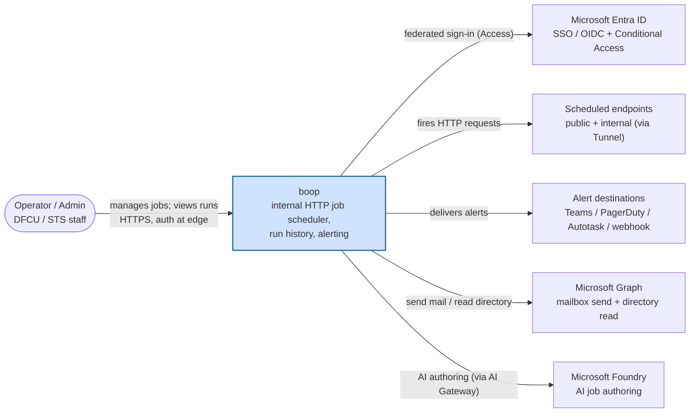
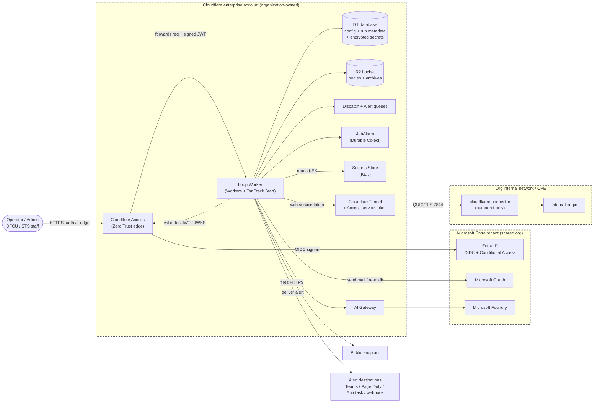

# TRC Deck Build Brief — boop

Hand this file to a deck-building agent. It contains everything needed to build the slides: per-slide content, speaker notes, layout hints, and the two diagram sources. Do not re-derive facts; use this file and the security architecture document.

## 1. Instructions for the deck-building agent (read first)

- **Goal.** Build a slide deck for the Technology Review Committee (TRC) from this file.
- **Audience.** Mixed. Technical and non-technical committee members.
- **Purpose (the ask).** Request approval to move boop from a pilot to production, for internal use.
- **Length.** About 11 slides, plus backup.
- **Writing style — ASD-STE100 (Simplified Technical English).** Use short active sentences. Use common words. Put one idea on each line. Keep the on-slide copy and the speaker notes close to what is written here. Do not add jargon or marketing words. Product names (Cloudflare Workers, Microsoft Entra ID, D1) stay as written.
- **Template.** Use the organization's TRC or corporate slide template if one is provided; otherwise use a clean, plain corporate template. Build one slide for each `### Slide N` heading in Section 3.
- **Diagrams.** Two slides need a diagram (Slide 6 and Slide 7). The sources are in Section 4 (Assets), written in Mermaid `flowchart`. Render each as an image and place it on its slide with the caption given. The same two diagrams also appear in `docs/security/architecture.md`.
- **Facts / source of truth.** Use only this file and the security architecture document (`docs/security/architecture.md`). Do not invent facts. Leave any placeholder in braces as-is for the presenter to fill.
- **Per-slide format.** Each slide has three parts: **On slide** (the words to show), **Say** (speaker notes, what to say out loud, do not read the slide word for word), **Layout** (slide type and any image).
- **Placeholders to fill:** `{presenter name}`, `{date}`, `{enterprise IR plan link}`.

## 2. Deck metadata

- **Title:** boop — internal job scheduler and alerting
- **Subtitle:** Technology Review Committee — pilot to production request
- **Footer (every slide):** Internal use · No member data · {date}

## 3. Slides

### Slide 1 — Title
**On slide:**
- boop — internal job scheduler and alerting
- Technology Review Committee
- Request: approve pilot → production (internal use)
- {presenter name} · {date}

**Say:** boop is a small internal tool. It runs scheduled web jobs and alerts staff when one fails. Today it is a pilot. We ask the committee to approve moving it to production for internal use.

**Layout:** Title slide. Small tag: "Internal use · No member data."

### Slide 2 — What boop is
**On slide:**
- boop runs web jobs on a schedule.
- It records each run and its result.
- It alerts staff when a job fails.
- It is built in-house and runs on tools we already own.

**Say:** Think of boop as a reliable timer plus a smoke alarm for our internal web tasks. It runs a job on a schedule, keeps a record, and tells the right people when something breaks. We built it ourselves on platforms the organization already pays for.

**Layout:** Content, four bullets. Optional simple icon row.

### Slide 3 — Why we built it
**On slide:**
- Scheduled jobs and health checks live in many places today (cron, manual scripts).
- A failure can go unnoticed.
- boop puts them in one place, with alerts and a clear record.
- It reuses platforms we already run and vet: Cloudflare and Microsoft Entra. No new vendor.
- It uses more of our Cloudflare investment (over $600K per year), which today is mostly DNS. No new license cost.

**Say:** Right now these jobs are scattered, and a silent failure can cost us time or trust. boop centralizes them and adds alerting and an audit trail. It also puts more of our existing Cloudflare spend to work. Today we use Cloudflare mostly for DNS; boop uses the parts we already pay for, at no new license cost.

**Layout:** Content, five bullets. Optional "before → after" visual (scattered scripts → one place).

### Slide 4 — Scope
**On slide:**
- In scope:
  - Run scheduled and webhook jobs.
  - Record every run and result.
  - Alert staff (Teams, email, PagerDuty, webhook).
  - Reach internal systems through a secure tunnel.
- Out of scope:
  - No member data or NPI.
  - Not member- or customer-facing.
  - Not a data-integration or ETL tool.

**Say:** Here is what boop does, and just as important, what it does not do. It schedules jobs, records results, and sends alerts, and it can reach internal systems safely. It holds no member data, it is staff-only, and it is not an integration or ETL platform.

**Layout:** Two columns: In scope / Out of scope.

### Slide 5 — Systems involved
**On slide:**
- App: Cloudflare Workers (serverless).
- Data: Cloudflare D1 (database) and R2 (file storage).
- Sign-in: Cloudflare Access with Microsoft Entra ID (staff accounts).
- Alerts: Microsoft 365 email, Microsoft Teams, PagerDuty, webhooks.
- Internal reach: Cloudflare Tunnel to on-premises systems.
- Optional AI help: Microsoft Foundry (writes a schedule from plain English).

**Say:** boop uses the platforms we already run. It runs on Cloudflare, stores data in Cloudflare, and signs staff in with their Microsoft account. Alerts go to the tools we already use. An optional AI helper can turn a plain-English request into a schedule.

**Layout:** Content, labeled list. Optional logo row (Cloudflare, Microsoft).

### Slide 6 — How the systems connect
**On slide:**
- (System Context diagram — Diagram A)
- Staff sign in through Microsoft Entra.
- boop calls the endpoints it schedules, sends alerts, and uses Microsoft services for email and AI.

**Say:** This is the big-picture view. Staff sign in through our Microsoft identity. From there, boop talks to the endpoints it schedules, the places it sends alerts, and Microsoft services for email and AI help. Nothing member-facing is involved.

**Layout:** Diagram slide. Render Diagram A (Section 4). Add its caption under the image.

### Slide 7 — Future-state architecture and data flow
**On slide:**
- (Container diagram with trust boundaries — Diagram B)
- Three trust zones: Cloudflare, Microsoft, our internal network.
- Data flow 1: a scheduled job fires and calls an endpoint.
- Data flow 2: a failure sends an alert.
- Internal systems are reached outbound-only. No new inbound firewall ports.

**Say:** This shows the parts and where our trust boundaries sit. A job fires on schedule, calls its endpoint, and records the result. If it fails, an alert goes out. Note the dashed boxes: to reach an internal system, boop uses an outbound-only tunnel, so we open no new inbound firewall ports.

**Layout:** Diagram slide. Render Diagram B (Section 4). Add its caption and two short data-flow labels.

### Slide 8 — Security
**On slide:**
- Staff sign in with their Microsoft account. Cloudflare Access checks them before the app runs.
- Staff-only. Two roles: admin and operator.
- Data is encrypted in transit (TLS) and at rest (Cloudflare).
- Secrets are encrypted with a key held in Cloudflare Secrets Store.
- boop holds no member data.
- Controls map to NCUA 12 CFR Part 748, Appendix A. Full detail is in the security architecture document.

**Say:** Security is built in at the edge. A user is checked by Cloudflare Access, backed by our Microsoft identity, before the app even runs. Data is encrypted in transit and at rest, and sensitive values are encrypted with a key we hold. We mapped the controls to the NCUA Part 748 safeguards, and the full security document is available as backup.

**Layout:** Content, six bullets. Cite the security document.

### Slide 9 — Risks, governance, and operations
**On slide:**
- Key-person risk: one owner today. Plan: cross-train and add a second owner.
- Independent review: a security assessment by someone other than the developer, before wide production use.
- Change control: every change goes through Git, automated checks, and a tagged release to production.
- Incident response: follows the enterprise Incident Response Plan.
- Planned items: backup/restore runbook, security-event alerts, group-based roles.

**Say:** We are naming our own risks. Today boop has one owner, so we plan to cross-train and add a second. Because one person built it, an independent reviewer should test it before wide use. Changes are controlled through Git and automated checks, and incident response follows the enterprise plan. A few hardening items are planned and listed here.

**Layout:** Content, five bullets. This slide answers the committee's risk questions directly.

### Slide 10 — The ask
**On slide:**
- Approve the move from pilot to production, for internal use.
- Production adds: more staff, more jobs onboarded, and the planned hardening items.
- Cost: no new license. Uses platforms we already own.

**Say:** Our request is simple. Approve moving boop from pilot to production for internal use. That lets more staff and more jobs use it, and we complete the planned hardening. There is no new license cost; boop uses platforms we already pay for.

**Layout:** Content, three bullets. Make the ask visually clear.

### Slide 11 — Q&A / backup
**On slide:**
- Questions
- Backup: security architecture document, the two diagrams, the Part 748 control table

**Say:** Thank you. I am happy to take questions. I also have the full security document and the control mapping as backup if the committee wants more detail.

**Layout:** Closing slide. List the backup materials.

## 4. Assets

### Diagram A — System Context (for Slide 6)
Caption: "boop is used only by staff, who sign in through Microsoft Entra. Its outbound links are the endpoints it schedules, the alert destinations, and Microsoft services for email and AI."

### Diagram B — Containers and trust boundaries (for Slide 7)
Caption: "Authentication happens at the Cloudflare Access edge before any request reaches the app. Internal systems are reached only through an outbound-only Cloudflare Tunnel."

### References
- Security architecture document: `docs/security/architecture.md` (controls, the Part 748 Appendix A table, data-flow detail, glossary).
- Part 748 Appendix A control table: Section 6 of the security document (use for the backup slide).

## 5. Facts the presenter can confirm on the call

- boop holds no member nonpublic personal information (NPI). Operational data and staff-facing alerts only.
- boop is first-party, in-house software of the consolidated organization (DFCU and its wholly-owned CUSO, STS), on the shared Cloudflare account and Microsoft Entra tenant.
- One developer/owner today (key-person risk, stated on Slide 9).
- No new license cost; boop runs on platforms the organization already owns.
